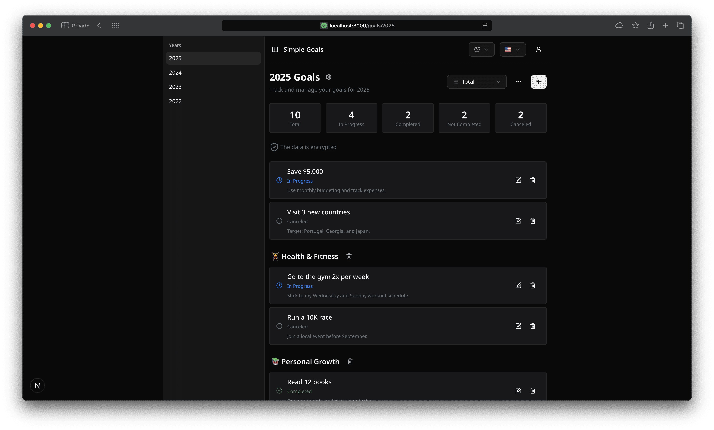

# Simple Goals

A lightweight, self-hosted app to set, track, and organize your yearly goals — with encryption and clear progress
statistics.



[All screenshots](./docs/screenshots.md)

Demo: https://simple-goals.vercel.app

## ✨ Features

- Set and track your yearly goals.

- Add descriptions and statuses (e.g., in progress, completed) to each goal.

- Encrypt goals locally — your data is encrypted and stored only on your device.

- View progress and statistics by year.

- Self-hosting support — run the app on your own server without relying on third-party services.

- Multilingual interface — available in English and Russian.

## 🚀 Quick Start (Self-Hosting with Docker)

### 1. Create `docker-compose.yml` file

```yml
services:
  simple-goals:
    image: smcnikita/simple-goals
    container_name: simple-goals-app
    restart: unless-stopped
    ports:
      - 9096:3000
    environment:
      - NEXTAUTH_URL=${APP_URL}
      - NEXTAUTH_SECRET=${NEXTAUTH_SECRET}
      - DATABASE_URL=postgresql://${POSTGRES_USER}:${POSTGRES_PASSWORD}@db:${POSTGRES_PORT}/${POSTGRES_DB}?schema=public
    build:
      context: .
      dockerfile: Dockerfile
      target: production
    depends_on:
      migrate:
        condition: service_completed_successfully

  db:
    image: postgres:16
    container_name: simple-goals-postgres
    restart: unless-stopped
    environment:
      - POSTGRES_USER
      - POSTGRES_PASSWORD
      - POSTGRES_DB
    volumes:
      - simple-goals-db:/var/lib/postgresql/data
    healthcheck:
      test: ['CMD-SHELL', 'pg_isready -U appuser -d appdb']
      interval: 10s
      timeout: 5s
      retries: 5

  migrate:
    container_name: simple-goals-migrate
    environment:
      - DATABASE_URL=postgresql://${POSTGRES_USER}:${POSTGRES_PASSWORD}@db:${POSTGRES_PORT}/${POSTGRES_DB}?schema=public
    command: sh -c "pnpx prisma migrate deploy && ./node_modules/.bin/tsx prisma/seeders/seed.ts"
    build:
      context: .
      dockerfile: Dockerfile
      target: builder
    depends_on:
      db:
        condition: service_healthy

volumes:
  simple-goals-db:
```

### 2. Create `.env` file

```bash
cp .env.example .env
```

Edit `.env` file:

- `APP_URL` - Which URL the application will be available at. By default `http://localhost:9096 `

- `NEXTAUTH_SECRET` – Secret key for NextAuth authentication.

Generate NEXTAUTH_SECRET:

```bash
openssl rand -base64 32
```

- `DATABASE_URL` - If you changed the `APP_URL`, then change the `DATABASE_URL`

- `POSTGRES_PASSWORD` - Change the password for the database

### 2. Start the App via Docker

Run the following command to build and start the containers in detached mode:

```bash
docker compose up -d
```

### 3. Open the App

Access your app in the browser:

- 👉 `http://localhost:9096` (for local use)
- 👉 `http://your-server-ip:9096` (for remote access)

### 4. Update

```bash
docker compose up -d --pull always
```

---

## ⚙️ Environment Variables

| Variable                | Description                   |
| ----------------------- | ----------------------------- |
| NEXT_TELEMETRY_DISABLED | Disable telemetry             |
| APP_URL                 | App URL                       |
| NEXTAUTH_SECRET         | Secret key for authentication |
| DATABASE_URL            | PostgreSQL connection string  |
| POSTGRES_USER           | PostgreSQL DB username        |
| POSTGRES_PASSWORD       | PostgreSQL DB password        |
| POSTGRES_PORT           | PostgreSQL DB port            |
| POSTGRES_DB             | PostgreSQL DB name            |

## 🛠 Development Setup

1. Install dependencies

   ```bash
   pnpm install
   ```

2. Initialize the database

   ```bash
   # Apply schema to database
   pnpx prisma migrate dev

   # Seed initial data (optional)
   pnpx prisma db seed
   ```

3. Run the development server
   ```bash
   pnpm dev
   ```
